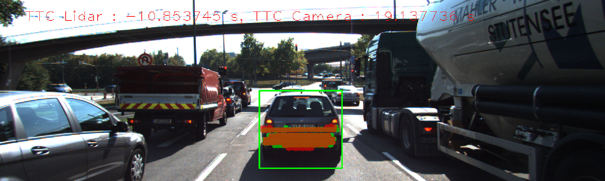
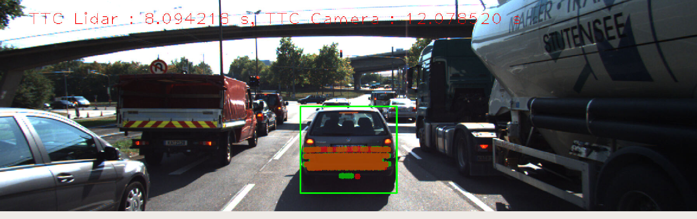
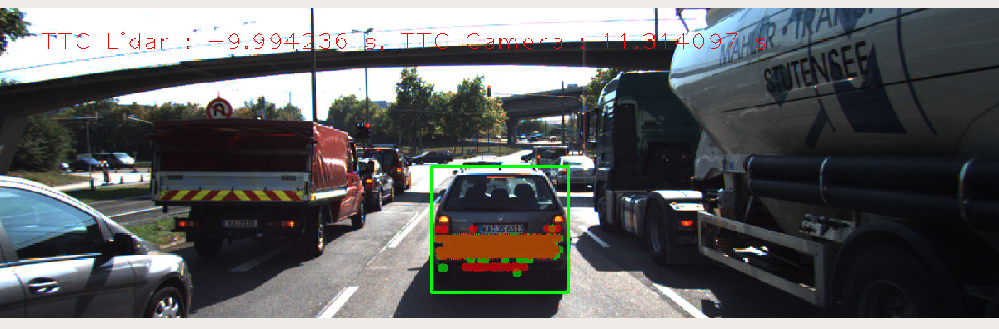

# SFND 3D Object Tracking - Final project

This repository contains the submission for the final "Camera class" project related to "Tracking an object in 3D space", which is part of Udacity's Sensor Fusion Nanodegree program.

To obtain the starter code, read about dependencies and/or basic build instructions, please refer to the following repository:
https://github.com/udacity/SFND_3D_Object_Tracking.git

## Report

---

#### Task FP.0 Final Report
> Provide a Writeup / README that includes all the rubric points and how you addressed each one. You can submit your writeup as markdown or pdf.

This README is created to meet this specification.

---

#### Task FP.1 Match 3D Objects
> Implement the method "matchBoundingBoxes", which takes as input both the previous and the current data frames and provides as output the ids of the matched regions of interest (i.e. the boxID property). Matches must be the ones with the highest number of keypoint correspondences.

```c++
void matchBoundingBoxes(std::vector<cv::DMatch> &matches, std::map<int, int> &bbBestMatches, DataFrame &prevFrame, DataFrame &currFrame)
{
  // NOTE: After calling a cv::DescriptorMatcher::match function, each DMatch
  // contains two keypoint indices, queryIdx and trainIdx, based on the order of image arguments to match.
  // prevFrame.keypoints is indexed by queryIdx
  // currFrame.keypoints is indexed by trainIdx
  
  int prev = prevFrame.boundingBoxes.size();
  int curr = currFrame.boundingBoxes.size();
  int countMatches[prev][curr] = {};

  // loop across all keypoint matches
  for (cv::DMatch match : matches) 
  {
    //Find the bounding box where the keypoints are locateed in the previos and current frame=candidates for matches
    cv::KeyPoint query = prevFrame.keypoints[match.queryIdx];
    auto query_pt = cv::Point(query.pt.x, query.pt.y);
    bool prevBB_found = false;
    
    cv::KeyPoint train = currFrame.keypoints[match.trainIdx];
    auto train_pt = cv::Point(train.pt.x, train.pt.y);
    bool currBB_found = false;
    
    std::vector<int> prevBB_id, currBB_id;

    // find bounding boxes in the previous frame that contain the matched keypoint
    for (auto itr_p = 0; itr_p < prev; itr_p++) 
    {
      if (prevFrame.boundingBoxes[itr_p].roi.contains(query_pt)) 
      {
        prevBB_found = true;
        prevBB_id.push_back(itr_p);
      }
    }
    // find bounding boxes in the current frame that contain the matched keypoint
    for (auto itr_c = 0; itr_c < curr; itr_c++) 
    {
      if (prevFrame.boundingBoxes[itr_c].roi.contains(train_pt)) 
      {
        currBB_found = true;
        currBB_id.push_back(itr_c);
      }
    }
    //Iterate through the bounding boxes 
    // increment counters for all possible bounding box mathches that contain the current matched keypoint 
    if (prevBB_found && currBB_found) 
    {
      for (auto itr_c : currBB_id) 
      {
        for (auto itr_p : prevBB_id) 
        {          
          countMatches[itr_p][itr_c] += 1;
        }
      }
    } 
    // for each bounding box in the previous frame, find the current frame bounding box with the most keypoint matches
    for (auto itr_p = 0; itr_p < prev; itr_p++)
    {
      int max_count = 0;
      int id_max = 0;
      for (auto itr_c = 0; itr_c < curr; itr_c++)
      {
        if (countMatches[itr_p][itr_c] > max_count)
        {
          max_count = countMatches[itr_p][itr_c];
          id_max = itr_c;
        }
      }  
      bbBestMatches[itr_p] = id_max;
    } 
  }
}
```

---

#### Task FP.2 Compute Lidar-based TTC
> Compute the time-to-collision in second for all matched 3D objects using only Lidar measurements from the matched bounding boxes between current and previous frame.

```c++
void computeTTCLidar(std::vector<LidarPoint> &lidarPointsPrev,
                     std::vector<LidarPoint> &lidarPointsCurr, double frameRate, double &TTC)
{
    // auxiliary variables
    double dT = 1/frameRate;        // time between two measurements in seconds
    double laneWidth = 4.0; // assumed width of the ego lane

    // find closest distance to Lidar points within ego lane
    double minXPrev = 1e9, minXCurr = 1e9;
    for (auto it = lidarPointsPrev.begin(); it != lidarPointsPrev.end(); ++it)
    {
        
        if (abs(it->y) <= laneWidth / 2.0)
        { // 3D point within ego lane?
            minXPrev = minXPrev > it->x ? it->x : minXPrev;
        }
    }
    for (auto it = lidarPointsCurr.begin(); it != lidarPointsCurr.end(); ++it)
    {
        if (abs(it->y) <= laneWidth / 2.0)
        { // 3D point within ego lane?
            minXCurr = minXCurr > it->x ? it->x : minXCurr;
        }
    }
    // compute TTC from both measurements
    TTC = minXCurr * dT / (minXPrev - minXCurr);
  	cout << "TTC for Lidar: " << TTC << endl;
}
```
#### Task FP.3 Associate Keypoint Correspondences with Bounding Boxes
> Prepare the TTC computation based on camera measurements by associating keypoint correspondences to the bounding boxes which enclose them. All matches which satisfy this condition must be added to a vector in the respective bounding box.

```c++
// associate a given bounding box with the keypoints it contains
void clusterKptMatchesWithROI(BoundingBox &boundingBox, std::vector<cv::KeyPoint> &kptsPrev, std::vector<cv::KeyPoint> &kptsCurr, std::vector<cv::DMatch> &kptMatches)
{
  std::vector<double> euclDistances;
  for(auto match:kptMatches)
  {
      cv::Point2f currKpCoord = kptsCurr[match.trainIdx].pt;
      cv::Point2f prevKpCoord = kptsPrev[match.queryIdx].pt;

      auto euclDist = cv::norm(currKpCoord-prevKpCoord);
      euclDistances.push_back(euclDist);
        
  }
  // calculate median euclidian distance
  int n = euclDistances.size();
  std::sort(euclDistances.begin(), euclDistances.end());
  double medianEuclDist = (euclDistances[std::ceil(n / 2. - 1)] + euclDistances[std::floor(n / 2.)]) / 2.0;
  
  for(auto it = 0; it<kptMatches.size(); it++)
  {
       cv::Point2f currKpCoord = kptsCurr[kptMatches[it].trainIdx].pt;
      if(boundingBox.roi.contains(currKpCoord) && euclDistances[it]< medianEuclDist)
      {
          boundingBox.kptMatches.push_back(kptMatches[it]);
      }
  }
}
```

---
#### Task FP.4 Compute Camera-based TTC
> Compute the time-to-collision in second for all matched 3D objects using only keypoint correspondences from the matched bounding boxes between current and previous frame.

```c++
// Compute time-to-collision (TTC) based on keypoint correspondences in successive images
void computeTTCCamera(std::vector<cv::KeyPoint> &kptsPrev, std::vector<cv::KeyPoint> &kptsCurr, 
                      std::vector<cv::DMatch> kptMatches, double frameRate, double &TTC, cv::Mat *visImg)
{
    // compute distance ratios between all matched keypoints
    vector<double> distRatios; // stores the distance ratios for all keypoints between curr. and prev. frame
    for (auto it1 = kptMatches.begin(); it1 != kptMatches.end() - 1; ++it1)
    { // outer kpt. loop

        // get current keypoint and its matched partner in the prev. frame
        cv::KeyPoint kpOuterCurr = kptsCurr.at(it1->trainIdx);
        cv::KeyPoint kpOuterPrev = kptsPrev.at(it1->queryIdx);

        for (auto it2 = kptMatches.begin() + 1; it2 != kptMatches.end(); ++it2)
        { // inner kpt.-loop

            double minDist = 100.0; // min. required distance

            // get next keypoint and its matched partner in the prev. frame
            cv::KeyPoint kpInnerCurr = kptsCurr.at(it2->trainIdx);
            cv::KeyPoint kpInnerPrev = kptsPrev.at(it2->queryIdx);

            // compute distances and distance ratios
            double distCurr = cv::norm(kpOuterCurr.pt - kpInnerCurr.pt);
            double distPrev = cv::norm(kpOuterPrev.pt - kpInnerPrev.pt);

            if (distPrev > std::numeric_limits<double>::epsilon() && distCurr >= minDist)
            { // avoid division by zero

                double distRatio = distCurr / distPrev;
                distRatios.push_back(distRatio);
            }
        } // eof inner loop over all matched kpts
    }     // eof outer loop over all matched kpts

    // only continue if list of distance ratios is not empty
    if (distRatios.size() == 0)
    {
        TTC = NAN;
        return;
    }


    // STUDENT TASK (replacement for meanDistRatio)
    std::sort(distRatios.begin(), distRatios.end());
    long medIndex = floor(distRatios.size() / 2.0);
    double medDistRatio = distRatios.size() % 2 == 0 ? (distRatios[medIndex - 1] + distRatios[medIndex]) / 2.0 : distRatios[medIndex]; // compute median dist. ratio to remove outlier influence

    double dT = 1 / frameRate;
    TTC = -dT / (1 - medDistRatio);
    cout << "TTC for Camera: " << TTC << endl;
}

```

---
#### Task FP.5 Performance Evaluation 1
> Look for several examples where you have the impression that the Lidar-based TTC estimate is way off. Once you have found those, describe your observations and provide a sound argumentation why you think this happened.

The Images show lidar points in the previous frame in green and in the current with red. There is clearly a difference in the measured points and this causes the unrelaible TTC.




---
#### Task FP.6 Performance Evaluation 2
> Run several detector / descriptor combinations and look at the differences in TTC estimation. Find out which methods perform best and also include several examples where camera-based TTC estimation is way off. As with Lidar, describe your observations again and also look into potential reasons.

|Det/des combination|2|3|4|5|6|7|8|9|10|11|12|13|14|15|16|17|18|19|
|---------------|-------|-------|--------|-------|-------|-------|-------|-------|-------|--------|-------|-------|-------|-------|--------|-------|-------|-------|
|SHITOMASI/BRISK|14.1094|-inf|18.1502|-inf|32.7458|-inf|46.607|-inf|13.2095|-3.45031|22.9315|19.1377|13.503|14.0061|12.0785|-inf|11.3141|12.0282|
|SHITOMASI/BRIEF|13.0927|12.9069|13.0041|14.2689|13.119|13.6508|16.9035|12.4764|12.0645|13.1432|12.0155|13.018|11.0949|11.7236|13.7773|9.98388|11.2642|9.65309|
|SHITOMASI/ORB|12.7975|10.596|13.1082|23.7509|13.6889|12.7604|13.401|13.0449|11.3527|13.3448|13.0167|12.5588|11.2142|11.3592|11.946|10.0955|11.0932|7.87897|
|SHITOMASI/FREAK|13.5993|17.7333|12.7173|36.0865|-inf|15.4847|12.7375|13.7279|13.5427|20.6906|12.1119|16.2317|12.1365|12.0086|21.4667|11.1384|13.4095|7.34604|
|HARRIS/BRISK|12.5008|14.6618|19.4252|12.9793|-inf|30.0765|-1.69678|-27.9372|12.9594|23.197|12.8778|9.12463|10.4612|-inf|12.8981|13.4321|10.979|14.2532|
|HARRIS/BRIEF|12.37|12.4188|-1.91978|12.1503|13.4692|24.4903|13.4637|13.7279|11.272|14.9903|11.1985|11.9215|10.7347|11.2796|6.09702|10.9972|11.7691|10.0812|
|HARRIS/ORB|11.6594|12.0008|33.3851|13.7257|81.202|30.0765|13.4223|13.6065|11.272|13.0141|11.26|8.56336|23.4412|11.2796|5.56114|11.7219|11.7691|11.6215|
|HARRIS/FREAK|56.0386|12.878|13.1344|12.9015|12.1851|-inf|11.1899|13.5027|11.4048|13.1432|12.2375|12.9124|6.26849|11.6313|12.572|13.9493|11.7562|10.9003|
|FAST/BRISK|-0.121954|-0.143031|-0.371314|-0.126492|-0.14461|-0.119742|-0.167488|-0.276057|-0.169717|-0.193311|-0.141246|6.96657|-0.263895|-0.300483|-0.94391|-0.187974|-0.911686|-0.303624|
|FAST/BRIEF|Fungerade inte|3|4|5|6|7|8|9|10|11|12|13|14|15|16|17|18|19|
|FAST/ORB|-0.122123|-|-0.122338|-0.127755|-|-0.34718|0.0287349|-0.122187|-|-|-1.02852|-0.4522|-0.241474|-0.161573|-2.08042|-0.15487|-|-1.04496|
|FAST/FREAK|-0.223974|-0.135778|-0.221114|-0.14601|-0.214178|-0.173258|-0.252003|0.334848|-0.162033|-2.34349|-7.36005|-0.130252|-0.369233|-0.229151|-0.19427|-0.393693|-0.460221|-0.363482|
|BRISK/BRISK|2|3|4|5|6|7|8|9|10|11|12|13|14|15|16|17|18|19|
|BRISK/BRIEF|2|3|4|5|6|7|8|9|10|11|12|13|14|15|16|17|18|19|
|BRISK/ORB|2|3|4|5|6|7|8|9|10|11|12|13|14|15|16|17|18|19|
|BRISK/FREAK|2|3|4|5|6|7|8|9|10|11|12|13|14|15|16|17|18|19|
|ORB/BRISK|2|3|4|5|6|7|8|9|10|11|12|13|14|15|16|17|18|19|
|ORB/BRIEF|2|3|4|5|6|7|8|9|10|11|12|13|14|15|16|17|18|19|
|ORB/ORB|2|3|4|5|6|7|8|9|10|11|12|13|14|15|16|17|18|19|
|ORB/FREAK|2|3|4|5|6|7|8|9|10|11|12|13|14|15|16|17|18|19|
|ORB/AKAZE|2|3|4|5|6|7|8|9|10|11|12|13|14|15|16|17|18|19|
|AKAZE/BRISK|2|3|4|5|6|7|8|9|10|11|12|13|14|15|16|17|18|19|
|AKAZE/BRIEF|2|3|4|5|6|7|8|9|10|11|12|13|14|15|16|17|18|19|
|AKAZE/ORB|2|3|4|5|6|7|8|9|10|11|12|13|14|15|16|17|18|19|
|AKAZE/FREAK|2|3|4|5|6|7|8|9|10|11|12|13|14|15|16|17|18|19|

---